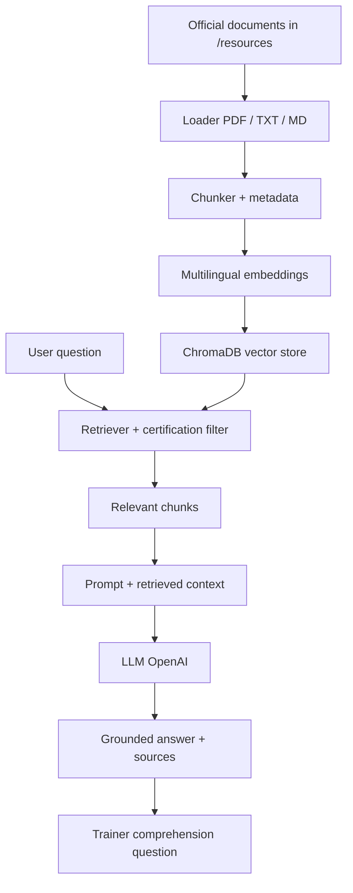

# Chat_ISTQB

**Unofficial AI Study Companion** for software testing professionals preparing for ISTQB certifications.

> A bilingual RAG-powered study companion for software testing professionals preparing for CTFL and CT-AI certifications.

**Unofficial educational project. Not affiliated with or endorsed by ISTQB®.**

---

## Overview

Chat_ISTQB is a portfolio / educational application that demonstrates a **clear, testable Retrieval-Augmented Generation (RAG)** pipeline for ISTQB study support.

It helps learners explore:

- **ISTQB CTFL — Foundation Level 4.0.1**
- **ISTQB CT-AI — AI Testing 2.0**

in **English** and **French**, with answers grounded in **documents you index locally**.

This repository does **not** redistribute official ISTQB syllabus PDFs. You must place your own legally obtained study materials under `/resources`.

---

## Why this project?

Many AI demos hide retrieval behind heavy frameworks. This project deliberately keeps the RAG path readable:

**documents → extract → clean → chunk → embed → vector DB → filter → retrieve → prompt → LLM → citations → comprehension check**

It also treats RAG as something a **QA engineer would test**: metadata isolation, missing-resource behaviour, retrieval hit rate, and mocked LLM flows.

---

## Features

- **Trainer mode** — explain → ask one comprehension question → wait → evaluate
- **Ask a Question mode** — concise grounded Q&A with citations
- **Quiz mode** — AI-generated practice MCQs (clearly labelled as non-official)
- **Bilingual UI** — French / English response language
- **Multilingual embeddings** — French questions can retrieve English sources (and vice versa)
- **Hard certification filtering** — CTFL never mixes with CT-AI in V1
- **Source citations** — up to 3 sources per answer
- **🔬 RAG Debug panel** — collapsed by default for portfolio / learning inspection
- **Retrieval evaluation harness** — Top-1 / Top-3 / Top-5 hit rates

---

## Supported certifications

| Certification | Version | Resource folder |
|---|---|---|
| CTFL | 4.0.1 | `resources/ctfl/{en,fr}/` |
| CT-AI | 2.0 | `resources/ct_ai/{en,fr}/` |

---

## Architecture



### Baseline RAG decisions (V1)

| Decision | Choice | Why |
|---|---|---|
| Embeddings | `paraphrase-multilingual-MiniLM-L12-v2` | Small, FR/EN capable, interview-explainable |
| Vector DB | ChromaDB (persistent) | Simple metadata filters, no extra infra |
| Chunk size | 1000 chars | Readable baseline |
| Overlap | 200 chars | Moderate continuity across boundaries |
| Retrieval | Top-k = 4, cosine | No reranker in V1 |
| LLM | OpenAI (`gpt-4o-mini` default) | Swappable via `LLMProvider` |

These are **baselines to measure**, not claimed optima.

---

## How RAG works in this project

1. You place official study files under `/resources`
2. `python -m src.ingestion.indexer` extracts text, chunks it, embeds it, stores vectors
3. The learner selects **certification**, **response language**, and **mode**
4. The retriever embeds the question and searches **only** that certification’s chunks
5. The LLM answers **from retrieved context** (or explicitly says information was not found)
6. The UI shows short source citations (not large copyrighted excerpts)
7. In Trainer mode, a comprehension question is asked and the student answer is evaluated against retrieved material again

---

## Project structure

```text
chat-istqb/
├── app.py                      # Streamlit UI
├── src/
│   ├── config.py               # Baseline RAG settings
│   ├── ingestion/              # Load → chunk → index
│   ├── rag/                    # Embeddings, vector store, retriever, pipeline
│   ├── llm/                    # Provider abstraction + OpenAI
│   ├── trainer/                # Trainer, evaluator, quiz, prompts
│   └── ui/                     # Translations + components
├── resources/                  # Your local study materials (PDFs gitignored)
├── vector_db/                  # Local Chroma persistence (gitignored)
├── evaluation/                 # Retrieval hit-rate evaluation
├── tests/                      # pytest suite (LLM mocked where needed)
├── .env.example
├── requirements.txt
└── README.md
```

---

## Installation

```bash
git clone <your-repo-url> Chat_ISTQB
cd Chat_ISTQB

python -m venv .venv

# Windows
.venv\Scripts\activate

# macOS / Linux
source .venv/bin/activate

pip install -r requirements.txt
copy .env.example .env   # Windows
# cp .env.example .env   # macOS / Linux
```

Edit `.env` and set:

```env
OPENAI_API_KEY=sk-...
```

Never commit `.env`.

---

## Adding official study resources

Place files here:

```text
resources/ctfl/en/
resources/ctfl/fr/
resources/ct_ai/en/
resources/ct_ai/fr/
```

Supported: `.pdf`, `.txt`, `.md`

Do **not** push copyrighted PDFs to a public repository.

---

## Building the vector index

```bash
python -m src.ingestion.indexer
```

Example output:

```text
CTFL / EN
  3 documents
  287 chunks
...
```

If the folders are empty, the command prints a helpful message and does not invent data.

---

## Running the application

```bash
streamlit run app.py
```

Then:

1. Select CTFL or CT-AI
2. Select English or Français
3. Choose Trainer / Ask / Quiz
4. Ask a study question

---

## Testing

```bash
pytest
```

Coverage includes:

- chunk metadata preservation
- CTFL vs CT-AI metadata isolation
- French / English query acceptance
- empty index / missing API key graceful behaviour
- trainer comprehension-question stage (mocked LLM)

No paid OpenAI calls are required for the default test suite.

---

## RAG evaluation

1. Index your documents
2. Edit `evaluation/questions.json` placeholders with real expected document stems
3. Run:

```bash
python -m evaluation.evaluate_retrieval
```

Reports Top-1 / Top-3 / Top-5 hit rates and certification-leak count.

---

## Screenshots

> _Placeholder — add UI screenshots here for your portfolio (Trainer answer + sources, Quiz score, RAG Debug panel)._

---

## Limitations

- Quality depends entirely on the documents you index
- Section/chapter/page metadata is best-effort from PDF text (never invented)
- Quiz questions are **AI-generated practice items**, not official exam questions
- No reranker, hybrid search, or persistent user accounts in V1
- Cross-lingual retrieval quality varies by embedding model and corpus
- Generation quality depends on the configured LLM provider

---

## Roadmap

- [ ] Fill a real retrieval evaluation set after indexing official materials
- [ ] Measure chunk-size / top-k trade-offs
- [ ] Optional hybrid BM25 + dense retrieval
- [ ] Lightweight groundedness / citation checks
- [ ] Optional chapter browser from metadata
- [ ] Alternative local LLM provider behind `LLMProvider`

---

## Disclaimer

Chat_ISTQB is an independent educational and portfolio project. It is not affiliated with, sponsored by, or endorsed by ISTQB®. ISTQB® is a registered trademark of the International Software Testing Qualifications Board. Users are responsible for obtaining study materials from their official sources.

---

## License

MIT — see [LICENSE](LICENSE).
